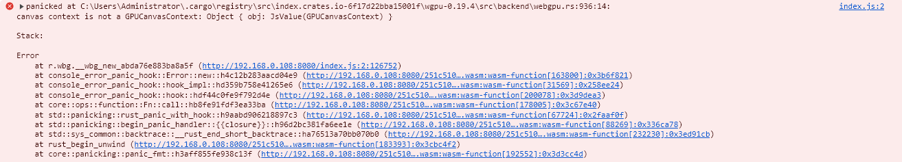

#TO Setup WASM with webpack
1. Go to with_winit run "wasm-pack build --target web --dev --weak-refs" 
2. Copy the generated pkg folder to this directory
3. Run "yarn run start" to serve from webpack dev server
4. Have fun 

#known Issue 

1.If we run the webpack server as http instead of https accessing through the Ipv4 address will Give a Wired Error with wgpu 19.4 as shown below. (notice You will get an Error for lacking Access authority issue for using http with wgpu 17) 

**`--cfg=web_sys_unstable_apis` is no longer needed in your `RUSTFLAGS` to compile for WebGPU and it won't help with this problem either**

2.There seems to be a problem with obtaining canvas size on android browser, the resolution keeps incrasing until the program crash. view comments in lib.rs for more details. 
